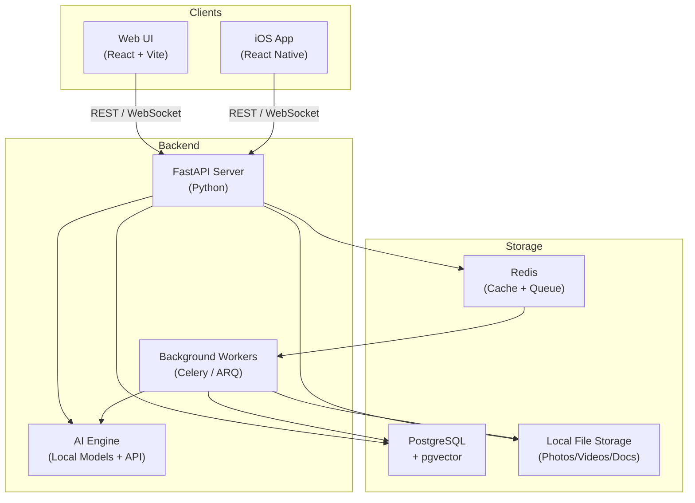
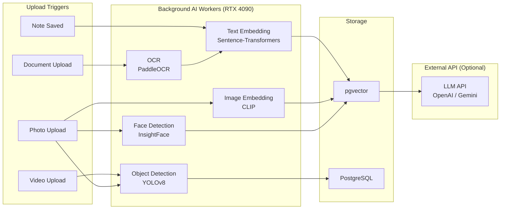

# MyWorld — High-Level Architecture Design

> **An all-in-one personal life OS** for habit tracking, task management, media libraries, knowledge management, and AI-powered intelligence.

---

## 1. System Architecture Overview



### Key Design Principles

- **Modular architecture** — each feature is an independent module with its own routes, models, and services
- **User-scoped from day 1** — every record has a `user_id` for future multi-user support
- **API-first** — web and iOS share the same REST API
- **Background processing** — AI tasks (face detection, embeddings, OCR) run asynchronously via task queue
- **Local-first** — everything runs on your PC, designed for future cloud migration

---

## 2. Tech Stack

| Layer | Technology | Why |
|---|---|---|
| **Web Frontend** | React 18 + Vite + React Router | You already know it, fast dev experience |
| **iOS App** | React Native + Expo | Shares JS/React skills, code reuse with web |
| **Backend API** | Python 3.12 + FastAPI | You already know it, async, great for AI/ML |
| **Database** | PostgreSQL 16 + pgvector | Relational + vector search in one DB |
| **Cache / Queue** | Redis | Fast caching + task queue broker |
| **Task Queue** | ARQ (async Redis queue) | Lightweight, Python-native, async-first |
| **File Storage** | Local filesystem (structured folders) | Simple, free, fast with SSD |
| **AI - Vision** | YOLO v8 / InsightFace (local, GPU) | Object detection + face recognition on RTX 4090 |
| **AI - Embeddings** | CLIP (images) + Sentence-Transformers (text) | Multi-modal embeddings for search |
| **AI - LLM** | Local: Ollama (Llama/Mistral) + External: OpenAI/Gemini API | RAG, summarization, chat |
| **AI - OCR** | PaddleOCR or Tesseract | Extract text from documents/images |
| **Containerization** | Docker + Docker Compose | One command to start everything |

---

## 3. Module Design

### 3.1 Dashboard Module
The home screen — aggregates data from all modules.

**Features:**
- Today's habit progress (ring/bar chart)
- Upcoming & overdue tasks
- Recently added media (photos/videos)
- Current reading progress
- Quick-add buttons for tasks, habits, photos
- Weekly/monthly stats overview

---

### 3.2 Pursuits Module (Commitments + Records)

> A unified module that replaces separate Habit Tracker, Task Manager, and Goals with a flexible schema that can represent anything trackable.

**Features:**
- Everything is a **commitment** (habit, goal, task, list, or note) with type-specific behaviour
- Daily check-in for habits with streaks and completion stats
- Goal tracking with progress bars (percentage or checklist-based)
- Task management with status (not_started / in_progress / done) and priority
- Shopping lists / checklists as lightweight list-type commitments
- Free-form daily planner entries (records can exist without a commitment)
- Hierarchy via parent-child links (goals → sub-goals → tasks, habits linked to goals)
- Calendar heatmap and timeline views from the same records table
- Batch check-in for morning/evening routines

**Key DB Tables:**
```
commitments:       id, user_id, type, title, description, status, priority, config(JSONB), sort_order, created_at
commitment_links:  parent_id, child_id, sort_order
records:           id, commitment_id(optional), date, content, status, value, sort_order, created_at
```

**See:** [Full design doc](agents/design-doc/backend-01-commitments-and-records.md) for complete table definitions, API spec, and usage patterns.

---

### 3.3 Label System (Cross-Cutting Tagging)

> A centralized GitHub-style tagging system that allows users to categorize any entity across the platform.

**Features:**
- Global labels with names, hex colors, and descriptions
- Attached polymorphically to any entity (commitments, records, notes, photos)
- Enables cross-module filtering and querying (e.g., view all tasks and notes tagged "Health")

**Key DB Tables:**
```
labels:         id, user_id, name, color, description, created_at
entity_labels:  label_id, entity_id, entity_type, created_at
```

**See:** [Label System doc](agents/design-doc/backend-02-label-system.md) for details.

---

### 3.4 Photo Library Module

**Features:**
- Upload & organize photos into albums
- Auto-generate thumbnails (multiple sizes)
- Timeline view (by date) + album view
- AI: face detection & recognition → auto-group by person
- AI: object/scene detection → auto-tagging
- AI: CLIP embeddings → natural language search ("sunset at beach")
- EXIF metadata extraction (date, location, camera)
- Map view (photos on a map by GPS)
- Favorites & archive

**Key DB Tables:**
```
photos: id, user_id, album_id, filename, filepath, thumbnail_path, width, height, 
        file_size, mime_type, taken_at, gps_lat, gps_lng, exif_data, is_favorite, created_at
albums: id, user_id, name, cover_photo_id, created_at
photo_tags: id, photo_id, tag, confidence, source (ai/manual)
photo_faces: id, photo_id, person_id, bbox_x, bbox_y, bbox_w, bbox_h, embedding (vector)
persons: id, user_id, name, avatar_photo_id
photo_embeddings: id, photo_id, embedding (vector 512/768 dim)
```

---

### 3.5 Video Library Module

**Features:**
- Upload & organize videos into collections
- Auto-generate thumbnails & preview clips
- Metadata extraction (duration, resolution, codec)
- Streaming playback with seeking
- AI: scene detection, auto-tagging
- Categories & tags

**Key DB Tables:**
```
videos: id, user_id, collection_id, filename, filepath, thumbnail_path,
        duration, width, height, file_size, codec, is_favorite, created_at
collections: id, user_id, name, cover_video_id
video_tags: id, video_id, tag, confidence, source
```

---

### 3.6 Ebook Module

**Features:**
- Upload ebooks (EPUB, PDF)
- In-browser reader (epub.js for EPUB, pdf.js for PDF)
- Reading progress tracking (page/percentage)
- Bookmarks & highlights
- Notes per book
- AI: extract summaries, key concepts → feed into knowledge space
- Library view with cover images

**Key DB Tables:**
```
books: id, user_id, title, author, cover_path, filepath, format, total_pages,
       current_page, progress_pct, started_at, finished_at, created_at
bookmarks: id, book_id, user_id, page, position, label
highlights: id, book_id, user_id, text, page, color, note, created_at
```

---

### 3.7 Document Module

**Features:**
- Upload documents (PDF, Word, text, markdown)
- Folder structure for organization
- Preview in browser
- Full-text search (extracted text indexed)
- AI: OCR for scanned documents
- AI: text embeddings for semantic search
- Tags & categories

**Key DB Tables:**
```
documents: id, user_id, folder_id, filename, filepath, mime_type, file_size,
           extracted_text, is_ocr_processed, created_at
folders: id, user_id, parent_folder_id, name
doc_embeddings: id, document_id, chunk_index, chunk_text, embedding (vector)
```

---

### 3.8 Knowledge Space Module

**Features:**
- Create knowledge bases (topics/areas)
- Add notes (rich text / markdown editor)
- Link notes to each other (wiki-style)
- Auto-import highlights & notes from ebooks
- Auto-import tagged documents
- AI: RAG — ask questions, get answers from your knowledge base
- AI: auto-suggest related notes
- AI: summarize & connect concepts across notes
- Search across all knowledge

**Key DB Tables:**
```
knowledge_spaces: id, user_id, name, description, icon
notes: id, user_id, space_id, title, content_md, content_html, created_at, updated_at
note_links: source_note_id, target_note_id
note_embeddings: id, note_id, chunk_index, chunk_text, embedding (vector)
```

---

## 4. API Design

### URL Structure
```
/api/v1/auth/...              # Future: login, register, token
/api/v1/dashboard/...          # Dashboard aggregation
	/api/v1/pursuits/...           # Commitments + Records (habits, goals, tasks, lists, planner)
/api/v1/photos/...             # Upload, list, search
/api/v1/albums/...             # Album management
/api/v1/videos/...             # Upload, list, stream
/api/v1/books/...              # Library, reading progress
/api/v1/documents/...          # Upload, search, preview
/api/v1/knowledge/...          # Spaces, notes, RAG queries
/api/v1/ai/...                 # AI operations (search, ask, detect)
/api/v1/files/...              # File serving (thumbnails, media)
```

### Common Patterns
- **Pagination**: `?page=1&per_page=20`
- **Filtering**: `?status=active&priority=high`
- **Sorting**: `?sort_by=created_at&order=desc`
- **Search**: `?q=search+term` (text) or `/ai/search?q=natural+language` (semantic)

---

## 5. AI Pipeline Architecture



### AI Processing Flow
1. **User uploads a photo** → API saves file, creates DB record, enqueues AI tasks
2. **Background worker picks up tasks:**
   - Face detection → crop faces → compute face embeddings → match against known persons → store
   - Object detection → extract labels ("dog", "beach", "car") → store as tags
   - CLIP embedding → store 512-dim vector for semantic search
3. **User searches "photos of my dog at the beach"** → embed query with CLIP → pgvector similarity search → return results

### Local Model Sizing (RTX 4090 — 24GB VRAM)
| Model | VRAM Usage | Purpose |
|---|---|---|
| InsightFace | ~1 GB | Face detection + recognition |
| YOLOv8-l | ~2 GB | Object detection |
| CLIP ViT-L/14 | ~2 GB | Image-text embeddings |
| Sentence-Transformers | ~1 GB | Text embeddings |
| Ollama (Llama 3 8B) | ~6 GB | Local LLM for RAG |
| **Total** | **~12 GB** | Leaves 12GB headroom |

---

## 6. File Storage Structure

```
myworld-storage/
├── photos/
│   ├── originals/
│   │   └── 2026/05/06/
│   │       └── {uuid}.jpg
│   └── thumbnails/
│       └── 2026/05/06/
│           ├── {uuid}_sm.jpg    (200px)
│           ├── {uuid}_md.jpg    (600px)
│           └── {uuid}_lg.jpg    (1200px)
├── videos/
│   ├── originals/
│   │   └── 2026/05/06/{uuid}.mp4
│   └── thumbnails/
│       └── 2026/05/06/{uuid}_thumb.jpg
├── books/
│   └── {uuid}.epub
├── documents/
│   └── {uuid}.pdf
└── avatars/
    └── {uuid}.jpg
```

- Files organized by **date** to avoid too many files per folder
- UUIDs for filenames to prevent conflicts
- Originals always preserved, thumbnails are regeneratable

---

## 7. Project Directory Structure

```
myworld/
├── docker-compose.dev.yml          # PostgreSQL, Redis — local dev infrastructure
├── docker-compose.staging.yml      # All services — self-contained staging environment
├── .env                            # Config: DB credentials, API keys, storage path
├── README.md
│
├── backend/
│   ├── requirements.txt
│   ├── main.py                     # FastAPI app entry point
│   ├── config.py                   # Settings (from .env)
│   ├── core/                       # Core infrastructure (logger, app setup)
│   │   ├── __init__.py
│   │   ├── logger.py               # Loguru logging config
│   │   └── setup.py                # App setup (middleware, exception handlers)
│   ├── middlewares/                 # FastAPI middlewares
│   │   ├── __init__.py
│   │   └── logging_middleware.py   # Request ID generation, timing, logging
│   ├── database.py                 # SQLAlchemy engine + session
│   ├── models/                     # SQLAlchemy ORM models
│   │   ├── user.py
│   │   ├── commitment.py
│   │   ├── record.py
│   │   ├── photo.py
│   │   ├── video.py
│   │   ├── book.py
│   │   ├── document.py
│   │   └── knowledge.py
│   ├── schemas/                    # Pydantic request/response schemas
│   ├── routers/                    # API route handlers (one per module)
│   ├── services/                   # Business logic layer
│   ├── ai/                         # AI processing modules
│   │   ├── face_recognition.py
│   │   ├── object_detection.py
│   │   ├── embeddings.py
│   │   ├── ocr.py
│   │   └── rag.py
│   ├── workers/                    # Background task definitions
│   └── utils/                      # Shared utilities
│
├── frontend/
│   ├── package.json
│   ├── vite.config.js
│   ├── index.html
│   └── src/
│       ├── main.jsx
│       ├── App.jsx
│       ├── api/                    # API client (shared patterns for mobile)
│       ├── components/             # Reusable UI components
│       ├── views/                  # Page-level components
│       │   ├── Dashboard.jsx
│       │   ├── Commitments.jsx
│       │   ├── DailyLog.jsx
│       │   ├── Photos.jsx
│       │   ├── Videos.jsx
│       │   ├── Books.jsx
│       │   ├── Documents.jsx
│       │   └── Knowledge.jsx
│       ├── hooks/                  # Custom React hooks
│       ├── stores/                 # State management (Zustand or Context)
│       └── styles/                 # CSS files
│
├── mobile/                         # React Native (Expo)
│   ├── package.json
│   ├── app.json
│   ├── App.js
│   ├── src/
│   │   ├── screens/               # Screen components
│   │   ├── components/            # Reusable mobile components
│   │   ├── api/                   # Shared API client (can share with web)
│   │   ├── navigation/            # React Navigation setup
│   │   └── stores/                # State management
│   └── assets/
│
└── scripts/
    ├── setup.sh                   # Initial setup script
    └── seed.py                    # Optional: seed demo data
```

- **Phase 1 Stack (local dev):**
  - Host OS runs `uvicorn main:app --reload` (FastAPI) and `npm run dev` (Vite, port 5173 with `/api` proxying to `http://localhost:8000`).
  - Docker Compose runs Postgres pgvector (`mynest-postgres:5432`) and Redis (`mynest-redis:6379`).

- **Production Target (Phase 2+):**
  - Single multi-stage Docker image (`mynest`) containing Node-built static frontend assets and FastAPI backend.
  - Deployed alongside Postgres pgvector and Redis via `docker-compose.prod.yml`.

---

## 8. Development Roadmap

> 📋 See [roadmap.md](./roadmap.md) for the full roadmap with progress tracking.

| Phase | What | Weeks |
|---|---|---|
| **1** | Foundation (Docker, FastAPI, React scaffold) | 1-2 |
| **2** | Habit Tracker + Task Manager + Dashboard | 3-6 |
| **3** | iOS App v1 (Dashboard, Habits, Tasks) | 7-9 |
| **4** | Knowledge Space + RAG | 10-13 |
| **5** | Media & Files (Photos, Videos, Ebooks, Docs) | 14-19 |
| **6** | AI Features (face/object detection, embeddings) | 20-24 |
| **7** | iOS App v2 (expand to all modules) | 25-28 |
| **8** | Multi-user & Cloud | Future |

---

## 9. Key Design Decisions Summary

| Decision | Choice | Rationale |
|---|---|---|
| Monorepo vs separate repos | **Monorepo** | Easier to manage for personal project |
| ORM | **SQLAlchemy 2.0** | Mature, great PostgreSQL + pgvector support |
| Migrations | **Alembic** | Standard for SQLAlchemy |
| State management (web) | **Zustand** | Lightweight, simple, no boilerplate |
| State management (mobile) | **Zustand** | Same as web — shared mental model |
| API client | **Axios** | Can share between web & React Native |
| Background tasks | **ARQ** | Async, lightweight, Redis-based |
| Containerization | **Docker Compose** | One command: `docker-compose up` |
| AI model serving | **Direct Python** (not separate service) | Simpler for personal use, models loaded in workers |

---

## Verification Plan

### Phase 1 Verification
- `docker-compose up` starts all services successfully
- API health endpoint returns 200
- Web UI loads with navigation sidebar
- Database tables created via migration

### Per-Module Verification
- Full CRUD operations work via API + UI
- File uploads save correctly to structured storage
- Background AI tasks process and store results
- Semantic search returns relevant results

