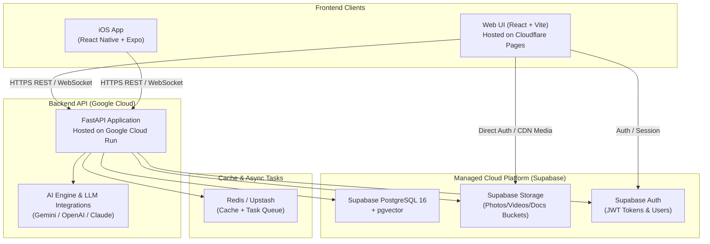
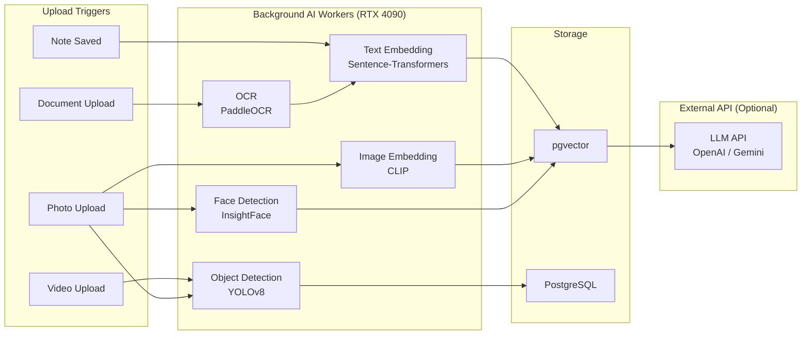
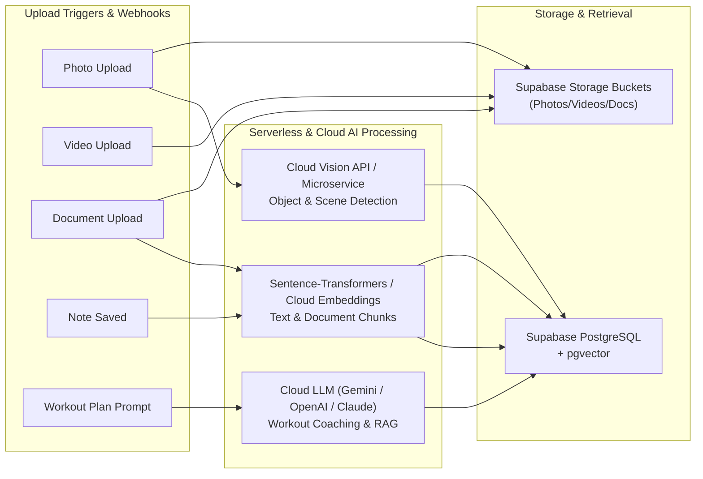

# MyWorld — High-Level Architecture Design

> **An all-in-one personal life OS** for habit tracking, task management, media libraries, knowledge management, and AI-powered intelligence.

---

## 1. System Architecture Overview


```mermaid
graph TB
    subgraph "Frontend Clients"
        CF["Web UI (React + Vite)<br/>Hosted on Cloudflare Pages"]
        IOS["iOS App<br/>(React Native + Expo)"]
    end

    subgraph "Backend API (Google Cloud)"
        RUN["FastAPI Application<br/>Hosted on Google Cloud Run"]
        AI["AI Engine & LLM Integrations<br/>(Gemini / OpenAI / Claude)"]
    end

    subgraph "Managed Cloud Platform (Supabase)"
        PG["Supabase PostgreSQL 16<br/>+ pgvector"]
        STORAGE["Supabase Storage<br/>(Photos/Videos/Docs Buckets)"]
        AUTH["Supabase Auth<br/>(JWT Tokens & Users)"]
    end

    subgraph "Cache & Async Tasks"
        REDIS["Redis / Upstash<br/>(Cache + Task Queue)"]
    end

    CF -->|HTTPS REST / WebSocket| RUN
    IOS -->|HTTPS REST / WebSocket| RUN
    CF -->|Direct Auth / CDN Media| STORAGE
    CF -->|Auth / Session| AUTH
    RUN --> PG
    RUN --> STORAGE
    RUN --> AUTH
    RUN --> REDIS
    RUN --> AI
```

### Key Design Principles

- **Cloud-Native & Serverless** — Frontend on Cloudflare Pages, Backend on Google Cloud Run (auto-scaling to zero), and Database/Storage on Supabase.
- **Low Maintenance & High Availability** — Fully managed infrastructure with no self-hosted server maintenance required.
- **User-Scoped & Secure from Day 1** — Powered by Supabase Auth (JWT) and PostgreSQL Row Level Security (RLS) / user scoping.
- **API-First & Decoupled** — Web and mobile share the same REST API with standardized envelopes.
- **Asynchronous AI Processing** — Background tasks for embeddings, summaries, and vision processing run seamlessly in the cloud.

---

## 2. Tech Stack

| Layer | Technology | Why |
|---|---|---|
| **Web Frontend Hosting** | Cloudflare Pages | Instant global CDN, fast edge deployment, zero maintenance |
| **Web Frontend Framework** | React 18 + Vite + React Router | High-performance SPA with modern React tooling |
| **Mobile App** | React Native + Expo | Code reuse with web API client, fast cross-platform delivery |
| **Backend API & Hosting** | Python 3.12 + FastAPI on Google Cloud Run | Fast async execution, containerized auto-scaling, scale-to-zero cost efficiency |
| **Database** | Supabase (PostgreSQL 16 + pgvector) | Fully managed Postgres with native vector search support |
| **Authentication** | Supabase Auth (JWT) | Robust user management, social auth ready, secure token handling |
| **File Storage** | Supabase Storage (S3-compatible) | Managed CDN buckets for photos, videos, books, documents, avatars |
| **Cache / Queue** | Redis (Upstash / Cloud Redis) | Low-latency caching and background worker broker |
| **AI - LLM Engine** | External Cloud APIs (Gemini / OpenAI / Anthropic) | Cloud-native intelligence for workout planning, RAG, and summarization |
| **AI - Embeddings & Vision** | Cloud Vision / Local AI workers + Sentence-Transformers | Multi-modal embeddings stored directly in Supabase pgvector |
| **Containerization & CI/CD** | Docker + GitHub Actions | Automated build & deploy to Cloud Run and Cloudflare Pages |

---

## 3. Module Design

### 3.1 Dashboard Module
The home screen — aggregates data from all modules.

**Features:**
- Today's habit progress (ring/bar chart)
- Upcoming & overdue tasks
- Recently added media (photos/videos)
- Current reading progress
- Quick-add buttons for tasks, habits, photos
- Weekly/monthly stats overview

---

### 3.2 Pursuits Module (Commitments + Records)

> A unified module that replaces separate Habit Tracker, Task Manager, and Goals with a flexible schema that can represent anything trackable.

**Features:**
- Everything is a **commitment** (habit, goal, task, list, or note) with type-specific behaviour
- Daily check-in for habits with streaks and completion stats
- Goal tracking with progress bars (percentage or checklist-based)
- Task management with status (not_started / in_progress / done) and priority
- Shopping lists / checklists as lightweight list-type commitments
- Free-form daily planner entries (records can exist without a commitment)
- Hierarchy via parent-child links (goals → sub-goals → tasks, habits linked to goals)
- Calendar heatmap and timeline views from the same records table
- Batch check-in for morning/evening routines

**Key DB Tables:**
```
commitments:       id, user_id, type, title, description, status, priority, config(JSONB), sort_order, created_at
commitment_links:  parent_id, child_id, sort_order
records:           id, commitment_id(optional), date, content, status, value, sort_order, created_at
```

**See:** [Full design doc](agents/design-doc/backend-01-commitments-and-records.md) for complete table definitions, API spec, and usage patterns.

---

### 3.3 Label System (Cross-Cutting Tagging)

> A centralized GitHub-style tagging system that allows users to categorize any entity across the platform.

**Features:**
- Global labels with names, hex colors, and descriptions
- Attached polymorphically to any entity (commitments, records, notes, photos)
- Enables cross-module filtering and querying (e.g., view all tasks and notes tagged "Health")

**Key DB Tables:**
```
labels:         id, user_id, name, color, description, created_at
entity_labels:  label_id, entity_id, entity_type, created_at
```

**See:** [Label System doc](agents/design-doc/backend-02-label-system.md) for details.

---

### 3.4 Workout & Fitness Module (AI-Enabled)

> An intelligent workout planner, real-time coach, and session logger that enables custom split generation, daily exercise guidance, and progressive overload tracking.

**Features:**
- **AI Workout Plan Generator**: Generates tailored multi-day workout splits (e.g., PPL, Upper/Lower, Full Body) based on fitness goals, equipment, schedule, and experience level.
- **AI Daily Suggestions & Coach**: Dynamic daily routine recommendations adapting to soreness, target muscle groups, time constraints, and available equipment.
- **Detailed Session Logger**: Log exercises, sets, reps, weight (kg/lbs), RPE, rest duration, and exercise notes with one-click completion.
- **Progressive Overload & Analytics**: Computes volume load, track personal records (PRs), frequency, and generates AI recovery & overload insights.
- **Dashboard & Pursuits Sync**: Automatically syncs workout completions with daily logs and commitments.

**Key DB Tables:**
```
workout_plans:     id, user_id, title, description, split_type, schedule_days(JSONB), routine_data(JSONB), is_active, created_at, updated_at
workout_sessions:  id, user_id, plan_id(optional), date, title, duration_minutes, notes, status, created_at, updated_at
workout_exercises: id, session_id, exercise_name, muscle_group, sets_data(JSONB), sort_order, notes, created_at
```

---

### 3.5 Photo Library Module

**Features:**
- Upload & organize photos into albums
- Auto-generate thumbnails (multiple sizes)
- Timeline view (by date) + album view
- AI: face detection & recognition → auto-group by person
- AI: object/scene detection → auto-tagging
- AI: CLIP embeddings → natural language search ("sunset at beach")
- EXIF metadata extraction (date, location, camera)
- Map view (photos on a map by GPS)
- Favorites & archive

**Key DB Tables:**
```
photos: id, user_id, album_id, filename, filepath, thumbnail_path, width, height, 
        file_size, mime_type, taken_at, gps_lat, gps_lng, exif_data, is_favorite, created_at
albums: id, user_id, name, cover_photo_id, created_at
photo_tags: id, photo_id, tag, confidence, source (ai/manual)
photo_faces: id, photo_id, person_id, bbox_x, bbox_y, bbox_w, bbox_h, embedding (vector)
persons: id, user_id, name, avatar_photo_id
photo_embeddings: id, photo_id, embedding (vector 512/768 dim)
```

---

### 3.6 Video Library Module

**Features:**
- Upload & organize videos into collections
- Auto-generate thumbnails & preview clips
- Metadata extraction (duration, resolution, codec)
- Streaming playback with seeking
- AI: scene detection, auto-tagging
- Categories & tags

**Key DB Tables:**
```
videos: id, user_id, collection_id, filename, filepath, thumbnail_path,
        duration, width, height, file_size, codec, is_favorite, created_at
collections: id, user_id, name, cover_video_id
video_tags: id, video_id, tag, confidence, source
```

---

### 3.7 Ebook Module

**Features:**
- Upload ebooks (EPUB, PDF)
- In-browser reader (epub.js for EPUB, pdf.js for PDF)
- Reading progress tracking (page/percentage)
- Bookmarks & highlights
- Notes per book
- AI: extract summaries, key concepts → feed into knowledge space
- Library view with cover images

**Key DB Tables:**
```
books: id, user_id, title, author, cover_path, filepath, format, total_pages,
       current_page, progress_pct, started_at, finished_at, created_at
bookmarks: id, book_id, user_id, page, position, label
highlights: id, book_id, user_id, text, page, color, note, created_at
```

---

### 3.8 Document Module

**Features:**
- Upload documents (PDF, Word, text, markdown)
- Folder structure for organization
- Preview in browser
- Full-text search (extracted text indexed)
- AI: OCR for scanned documents
- AI: text embeddings for semantic search
- Tags & categories

**Key DB Tables:**
```
documents: id, user_id, folder_id, filename, filepath, mime_type, file_size,
           extracted_text, is_ocr_processed, created_at
folders: id, user_id, parent_folder_id, name
doc_embeddings: id, document_id, chunk_index, chunk_text, embedding (vector)
```

---

### 3.9 Knowledge Space Module

**Features:**
- Create knowledge bases (topics/areas)
- Add notes (rich text / markdown editor)
- Link notes to each other (wiki-style)
- Auto-import highlights & notes from ebooks
- Auto-import tagged documents
- AI: RAG — ask questions, get answers from your knowledge base
- AI: auto-suggest related notes
- AI: summarize & connect concepts across notes
- Search across all knowledge

**Key DB Tables:**
```
knowledge_spaces: id, user_id, name, description, icon
notes: id, user_id, space_id, title, content_md, content_html, created_at, updated_at
note_links: source_note_id, target_note_id
note_embeddings: id, note_id, chunk_index, chunk_text, embedding (vector)
```

---

## 4. API Design

### URL Structure
```
/api/v1/auth/...              # Future: login, register, token
/api/v1/dashboard/...         # Dashboard aggregation
/api/v1/pursuits/...          # Commitments + Records (habits, goals, tasks, lists, planner)
/api/v1/labels/...            # Global label system (create, attach, detach)
/api/v1/workouts/...          # AI workout plans, suggestions, sessions & exercise logs
/api/v1/photos/...            # Upload, list, search
/api/v1/albums/...            # Album management
/api/v1/videos/...            # Upload, list, stream
/api/v1/books/...             # Library, reading progress
/api/v1/documents/...         # Upload, search, preview
/api/v1/knowledge/...         # Spaces, notes, RAG queries
/api/v1/ai/...                # AI operations (search, ask, detect)
/api/v1/files/...             # File serving (thumbnails, media)
```

### Common Patterns
- **Pagination**: `?page=1&per_page=20`
- **Filtering**: `?status=active&priority=high`
- **Sorting**: `?sort_by=created_at&order=desc`
- **Search**: `?q=search+term` (text) or `/ai/search?q=natural+language` (semantic)

---

## 5. AI Pipeline Architecture


```mermaid
graph LR
    subgraph "Upload Triggers"
        P["Photo Upload"]
        V["Video Upload"]
        D["Document Upload"]
        N["Note Saved"]
    end

    subgraph "Background AI Workers (RTX 4090)"
        FACE["Face Detection<br/>InsightFace"]
        OBJ["Object Detection<br/>YOLOv8"]
        CLIP_IMG["Image Embedding<br/>CLIP"]
        OCR_W["OCR<br/>PaddleOCR"]
        TXT_EMB["Text Embedding<br/>Sentence-Transformers"]
    end

    subgraph "External API (Optional)"
        LLM["LLM API<br/>OpenAI / Gemini"]
    end

    subgraph "Storage"
        PGV["pgvector"]
        PG2["PostgreSQL"]
    end

    P --> FACE --> PGV
    P --> OBJ --> PG2
    P --> CLIP_IMG --> PGV
    V --> OBJ
    D --> OCR_W --> TXT_EMB --> PGV
    N --> TXT_EMB
    PGV --> LLM
```

## 5. AI Pipeline Architecture


```mermaid
graph LR
    subgraph "Upload Triggers & Webhooks"
        P["Photo Upload"]
        V["Video Upload"]
        D["Document Upload"]
        N["Note Saved"]
        W["Workout Plan Prompt"]
    end

    subgraph "Serverless & Cloud AI Processing"
        LLM["Cloud LLM (Gemini / OpenAI / Claude)<br/>Workout Coaching & RAG"]
        EMB["Sentence-Transformers / Cloud Embeddings<br/>Text & Document Chunks"]
        VISION["Cloud Vision API / Microservice<br/>Object & Scene Detection"]
    end

    subgraph "Storage & Retrieval"
        SUPA_PG["Supabase PostgreSQL<br/>+ pgvector"]
        SUPA_BUCKET["Supabase Storage Buckets<br/>(Photos/Videos/Docs)"]
    end

    P --> SUPA_BUCKET
    V --> SUPA_BUCKET
    D --> SUPA_BUCKET
    P --> VISION --> SUPA_PG
    D --> EMB --> SUPA_PG
    N --> EMB --> SUPA_PG
    W --> LLM --> SUPA_PG
```

### AI Processing Flow
1. **User requests workout plan / coaching** → Cloud Run invokes LLM (Gemini/OpenAI API) with user profile & historical session logs → saves structured routine to Supabase DB.
2. **User uploads media/document** → Asset saved to Supabase Storage bucket, DB record created, async embedding/vision tasks triggered.
3. **Semantic search & RAG** → Embed query → pgvector cosine distance search in Supabase → synthesize answer with Cloud LLM.

---

## 6. File Storage Structure (Supabase Storage)

Media assets and user documents are stored in dedicated **Supabase Storage Buckets** backed by global CDN:

| Bucket Name | Purpose | Access Policy |
|---|---|---|
| `photos` | Photo library originals and thumbnails | Private / authenticated user scoped |
| `videos` | Video originals, compressed streaming files, and preview clips | Private / authenticated user scoped |
| `books` | EPUB / PDF books | Private / authenticated user scoped |
| `documents` | User documents, notes attachments, and OCR files | Private / authenticated user scoped |
| `avatars` | User profile avatars | Public / authenticated |

**Object Path Convention:**
`{user_id}/{year}/{month}/{uuid}.{ext}` (e.g. `u123/2026/08/9b1deb4d-3b7d-4bad-9bdd-2b0d7b3dcb6d.jpg`)

---

## 7. Project Directory Structure

```
myworld/
├── docker-compose.dev.yml          # Local dev infra (PostgreSQL + Redis)
├── Dockerfile.backend              # Cloud Run container image for FastAPI
├── .env.example                    # Template for Supabase, Cloud Run, and LLM keys
├── README.md
│
├── backend/
│   ├── requirements.txt
│   ├── Dockerfile                  # Container build for Google Cloud Run
│   ├── main.py                     # FastAPI app entry point
│   ├── config.py                   # Settings (Supabase DB URL, Auth keys, Cloud Run PORT)
│   ├── core/                       # Core infrastructure (logger, app setup)
│   │   ├── __init__.py
│   │   ├── logger.py               # Loguru logging config
│   │   └── setup.py                # App setup (middleware, exception handlers)
│   ├── middlewares/                # FastAPI middlewares (logging, auth verification)
│   │   ├── __init__.py
│   │   ├── logging_middleware.py   # Request ID generation, timing, logging
│   │   └── auth_middleware.py      # Supabase JWT token verification
│   ├── database.py                 # SQLAlchemy async engine configured for Supabase PostgreSQL
│   ├── models/                     # SQLAlchemy ORM models
│   │   ├── user.py
│   │   ├── commitment.py
│   │   ├── record.py
│   │   ├── label.py
│   │   ├── workout.py
│   │   ├── photo.py
│   │   ├── video.py
│   │   ├── book.py
│   │   ├── document.py
│   │   └── knowledge.py
│   ├── schemas/                    # Pydantic request/response schemas
│   ├── routers/                    # API route handlers (one per module)
│   ├── services/                   # Business logic layer (workouts, pursuits, llm, supabase_storage)
│   │   ├── llm_service.py          # Multi-provider LLM service
│   │   ├── storage_service.py      # Supabase S3/Storage client
│   │   ├── workout_service.py
│   │   └── commitment_service.py
│   └── utils/                      # Shared utilities
│
├── frontend/
│   ├── package.json
│   ├── vite.config.js              # Vite build configured for Cloudflare Pages
│   ├── index.html
│   └── src/
│       ├── main.jsx
│       ├── App.jsx
│       ├── api/                    # API client (pointing to Cloud Run backend)
│       ├── components/             # Reusable UI components (Heatmap, Sidebar, etc.)
│       ├── views/                  # Page-level components
│       │   ├── Dashboard.jsx
│       │   ├── Commitments.jsx
│       │   ├── DailyLog.jsx
│       │   ├── Workouts.jsx
│       │   ├── Photos.jsx
│       │   ├── Videos.jsx
│       │   ├── Books.jsx
│       │   ├── Documents.jsx
│       │   └── Knowledge.jsx
│       ├── hooks/                  # Custom React hooks
│       ├── stores/                 # State management (Zustand)
│       └── styles/                 # CSS files
│
├── mobile/                         # React Native (Expo)
│   ├── package.json
│   ├── app.json
│   └── src/
│
└── scripts/
    ├── deploy_backend_cloud_run.sh # Deploy script for Google Cloud Run
    └── setup_supabase.py           # Supabase bucket initialization script
```

### Environment & Deployment Architecture

- **Local Development:**
  - Frontend: `npm run dev` on Vite (port 5173).
  - Backend: `uvicorn main:app --reload` on port 8000.
  - Database & Storage: Connected directly to Supabase cloud instance (or local Docker compose).

- **Production Cloud Deployment:**
  - **Frontend:** Built via Vite (`npm run build`) and deployed to **Cloudflare Pages** (global CDN edge).
  - **Backend:** Containerized via Dockerfile and deployed to **Google Cloud Run** with automatic HTTPS, environment variable injection, and scale-to-zero.
  - **Database & Auth & Storage:** Hosted on **Supabase** (Postgres 16 + pgvector + Supabase Auth + Supabase Storage).

---

## 8. Development Roadmap

> 📋 See [roadmap.md](./roadmap.md) for the full roadmap with progress tracking.

| Phase | Milestone | Scope |
|---|---|---|
| **1** | Foundation | Scaffolds, Alembic migrations, database layer, baseline API |
| **2** | Core Modules | Pursuits (Commitments + Records), AI Workout Module, Video Management |
| **3** | Web UI Responsiveness & Secure Cloud Deployment | Responsive Web UI (Desktop, iPad, iPhone), Cloud Hardening, Cloudflare Pages + Cloud Run + Supabase deployment ("Test & Experience") |
| **4** | Knowledge Space + Cloud RAG | Notes, links, Supabase pgvector text embeddings & LLM RAG chat |
| **5** | Photos, Ebooks & Documents | Photo library with thumbnails/tags, PDF/EPUB reader, document full-text search |
| **6** | Advanced Cloud AI Features | Cloud Vision analysis, automated highlights ingestion, smart insights |
| **7** | Mobile App (React Native / iOS & Android) | Consolidated native mobile app (Expo, camera upload, push notifications, offline sync) |
| **8** | Multi-User & Family Sharing | Multi-user accounts, family sharing, backup & export system |

---

## 9. Key Design Decisions Summary

| Decision | Choice | Rationale |
|---|---|---|
| Frontend Hosting | **Cloudflare Pages** | Zero maintenance, blazing-fast global edge CDN, seamless Vite integration |
| Backend Hosting | **Google Cloud Run** | Containerized serverless compute, auto-scaling to zero, low cost, HTTPS built-in |
| Database & Auth | **Supabase (PostgreSQL 16 + pgvector + Auth)** | Fully managed relational database + vector search + turnkey JWT authentication |
| Media Storage | **Supabase Storage** | S3-compatible buckets with CDN integration, unified access control with DB |
| LLM Provider | **Configurable Cloud LLM (Gemini / OpenAI)** | High-quality intelligence without needing local GPU hardware always running |
| Monorepo vs separate repos | **Monorepo** | Single repository simplifies coordinated frontend, backend, and mobile changes |
| State Management | **Zustand** | Lightweight, simple, shared mental model between Web and Mobile |

---

## Verification Plan

### Cloud Test & Experience Deployment Verification
- Supabase PostgreSQL instance reachable and Alembic migrations applied cleanly.
- Google Cloud Run service deployed, healthy, and servicing API routes at `/api/v1/...`.
- Cloudflare Pages build deployed and communicating with Cloud Run backend via HTTPS with valid CORS.
- User can interact with **Dashboard**, **Pursuits**, **Daily Log**, and **Calendar Heatmap** on the live cloud URL.

### Module Progression Verification
- **AI Workout Module**: Generates plans, logs sets/reps, calculates progressive volume, and updates daily calendar.
- **Video Management**: Uploads videos to Supabase Storage bucket, streams video smoothly in browser.
- **Data Integrity**: All records persist with accurate user scoping and proper timestamps.

